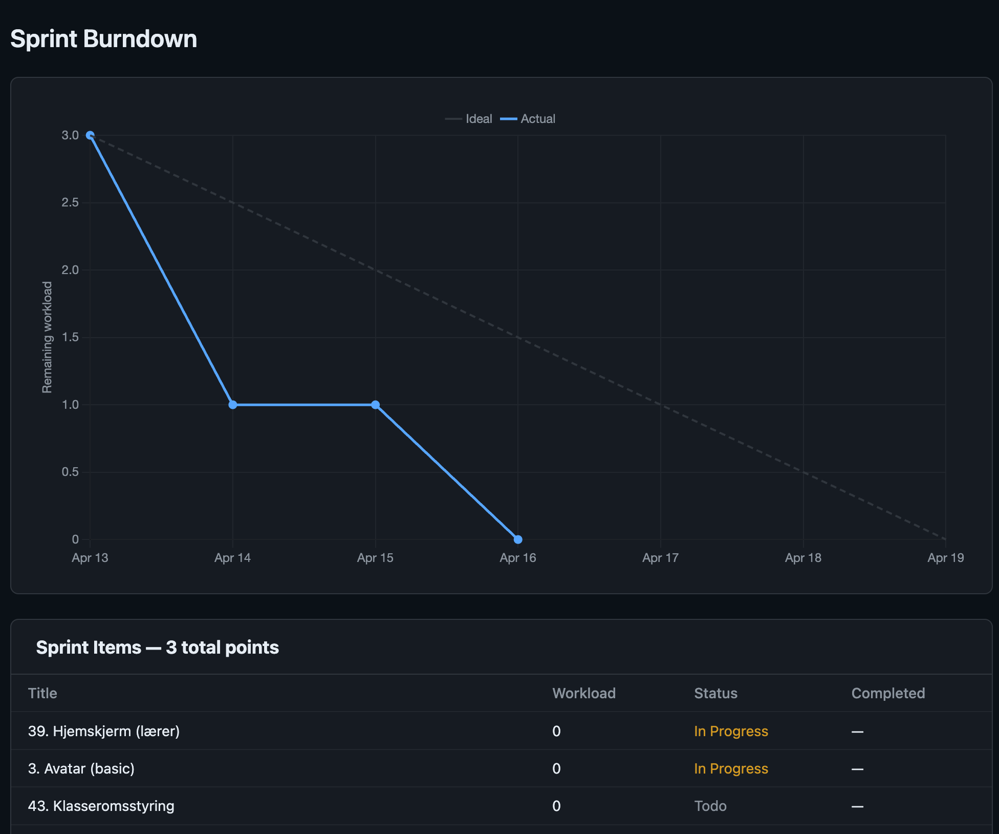

# Burndown Chart

A sprint burndown chart that pulls data from a GitHub Project (V2) and displays an interactive burndown graph with a table of sprint items. Built with Bun, React, and Chart.js.



## Features

- Fetches issues and pull requests from a GitHub Projects V2 board via the GraphQL API
- Tracks workload points and completion status per sprint
- Displays an ideal vs. actual burndown line chart
- Shows a sortable table of all sprint items with status and completion date
- Supports both GitHub.com and GitHub Enterprise
- Works with both organization and user-owned projects
- Dark theme UI inspired by GitHub

## Prerequisites

- [Bun](https://bun.sh) v1.3.10 or later
- A GitHub personal access token with `read:project` scope
- A GitHub Project (V2) with a numeric "Workload" field

## Setup

1. Clone the repository and install dependencies:

```bash
bun install
```

2. Create a `.env` file in the project root:

```env
# Required
GITHUB_TOKEN=ghp_xxxxxxxxxxxx
GITHUB_OWNER=your-org-or-username
GITHUB_PROJECT_NUMBER=1
SPRINT_START=2025-04-13
SPRINT_END=2025-04-19

# Optional
GITHUB_HOST=github.com              # default: github.com
GITHUB_OWNER_TYPE=organization      # "organization" or "user" (default: organization)
WORKLOAD_FIELD_NAME=Workload        # name of the numeric workload field (default: Workload)
STATUS_FIELD_NAME=Status            # name of the status field (default: Status)
DONE_STATUS_VALUE=Done              # value that marks an item as done (default: Done)
SPRINT_FIELD_NAME=Sprint            # name of the iteration/sprint field (default: Sprint)
SPRINT_NAME=Sprint 1                # filter items to a specific sprint (optional)
```

3. Run the server:

```bash
bun run index.ts
```

4. Open [http://localhost:3000](http://localhost:3000) in your browser.

## How It Works

The server queries the GitHub GraphQL API to fetch all items from the configured project board. Each item's **Workload** (points), **Status**, and **Sprint** fields are read to build the burndown data.

- **Ideal line** -- a straight line from total workload to zero across the sprint duration.
- **Actual line** -- remaining workload calculated by subtracting completed item points on their closure date. Only dates up to today are plotted.

## Tech Stack

- **Runtime**: [Bun](https://bun.sh)
- **Frontend**: React 19, Chart.js
- **API**: GitHub GraphQL (Projects V2)
